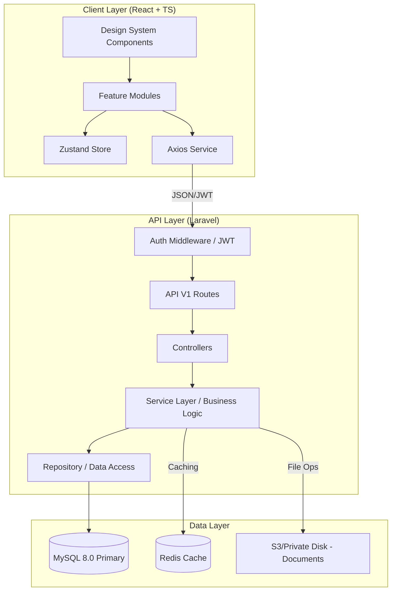

# System Architecture Diagram

```mermaid
graph TD
    subgraph "Client Layer (React + TS)"
        UI[Design System Components]
        State[Zustand Store]
        Features[Feature Modules]
        API_Client[Axios Service]
    end

    subgraph "API Layer (Laravel)"
        Gate[Auth Middleware / JWT]
        Route[API V1 Routes]
        Ctrl[Controllers]
        Srv[Service Layer / Business Logic]
        Repo[Repository / Data Access]
    end

    subgraph "Data Layer"
        DB[(MySQL 8.0 Primary)]
        Cache[(Redis Cache)]
        Storage[S3/Private Disk - Documents]
    end

    UI --> Features
    Features --> State
    Features --> API_Client
    API_Client -- "JSON/JWT" --> Gate
    Gate --> Route
    Route --> Ctrl
    Ctrl --> Srv
    Srv --> Repo
    Repo --> DB
    Srv -- "Caching" --> Cache
    Srv -- "File Ops" --> Storage
```
