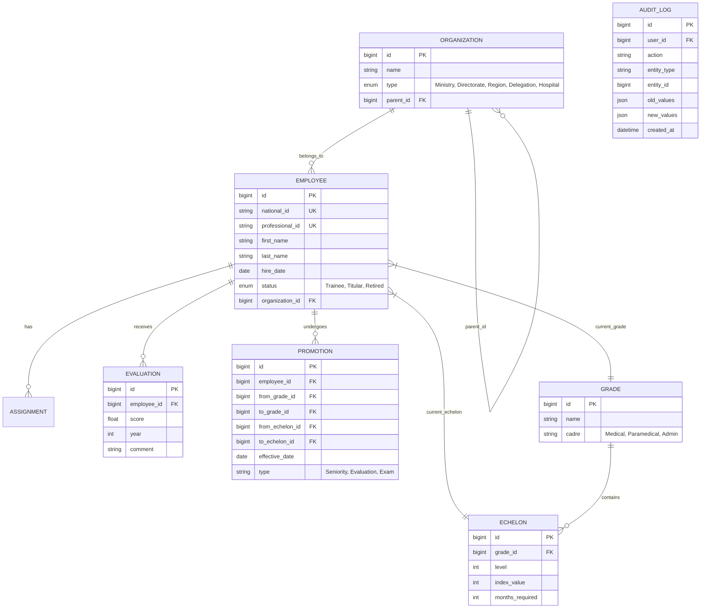

# Entity Relationship Diagram (ERD)

```mermaid
erDiagram
    ORGANIZATION ||--o{ ORGANIZATION : "parent_id"
    ORGANIZATION ||--o{ EMPLOYEE : "belongs_to"
    
    ORGANIZATION {
        bigint id PK
        string name
        enum type "Ministry, Directorate, Region, Delegation, Hospital"
        bigint parent_id FK
    }

    EMPLOYEE ||--o{ ASSIGNMENT : "has"
    EMPLOYEE ||--o{ EVALUATION : "receives"
    EMPLOYEE ||--o{ PROMOTION : "undergoes"
    EMPLOYEE }|--|| GRADE : "current_grade"
    EMPLOYEE }|--|| ECHELON : "current_echelon"

    EMPLOYEE {
        bigint id PK
        string national_id UK
        string professional_id UK
        string first_name
        string last_name
        date hire_date
        enum status "Trainee, Titular, Retired"
        bigint organization_id FK
    }

    GRADE ||--o{ ECHELON : "contains"
    GRADE {
        bigint id PK
        string name
        string cadre "Medical, Paramedical, Admin"
    }

    ECHELON {
        bigint id PK
        bigint grade_id FK
        int level
        int index_value
        int months_required
    }

    PROMOTION {
        bigint id PK
        bigint employee_id FK
        bigint from_grade_id FK
        bigint to_grade_id FK
        bigint from_echelon_id FK
        bigint to_echelon_id FK
        date effective_date
        string type "Seniority, Evaluation, Exam"
    }

    EVALUATION {
        bigint id PK
        bigint employee_id FK
        float score
        int year
        string comment
    }

    AUDIT_LOG {
        bigint id PK
        bigint user_id FK
        string action
        string entity_type
        bigint entity_id
        json old_values
        json new_values
        datetime created_at
    }
```
